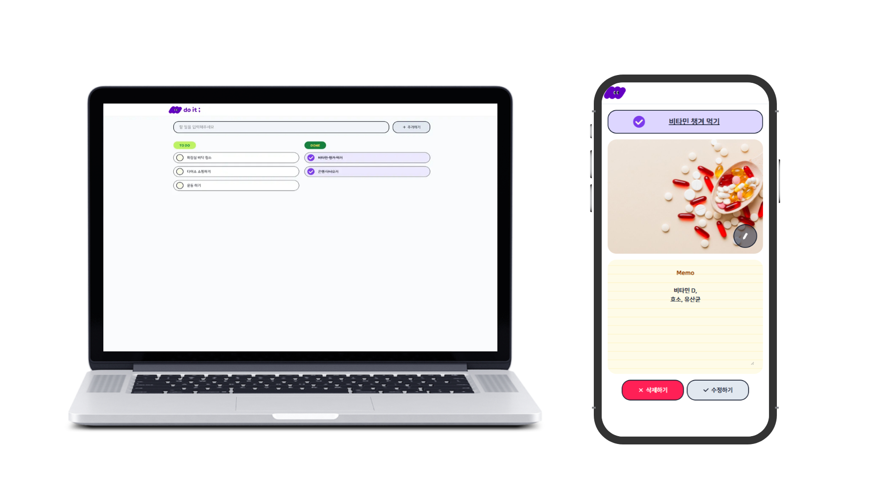
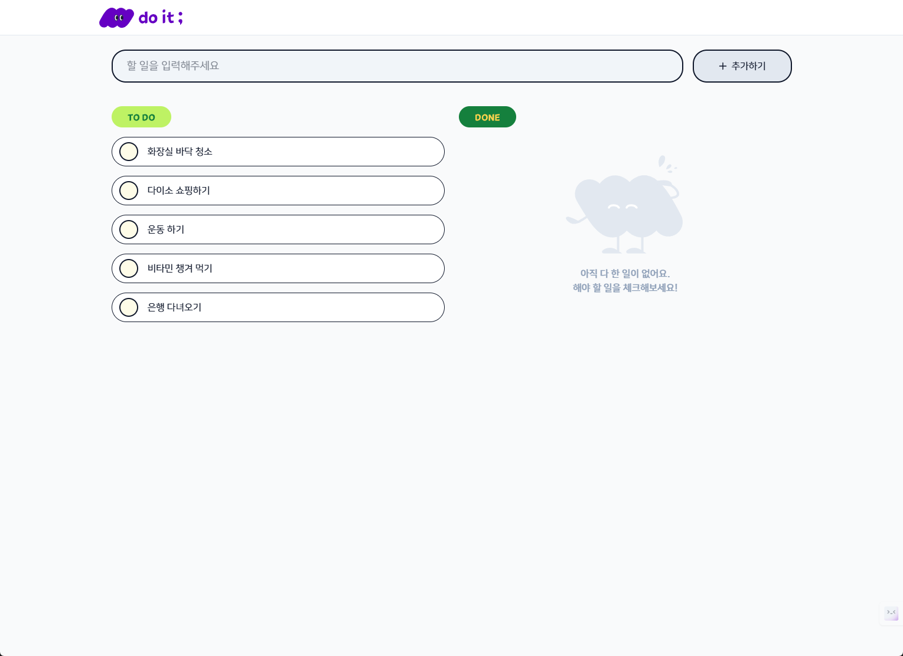
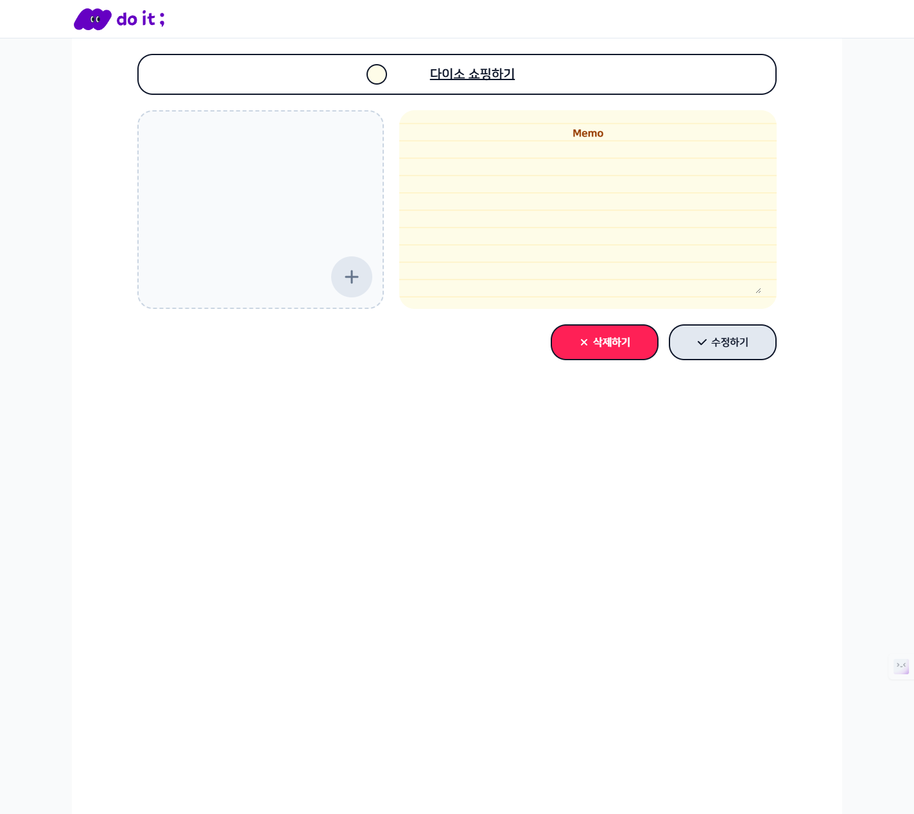
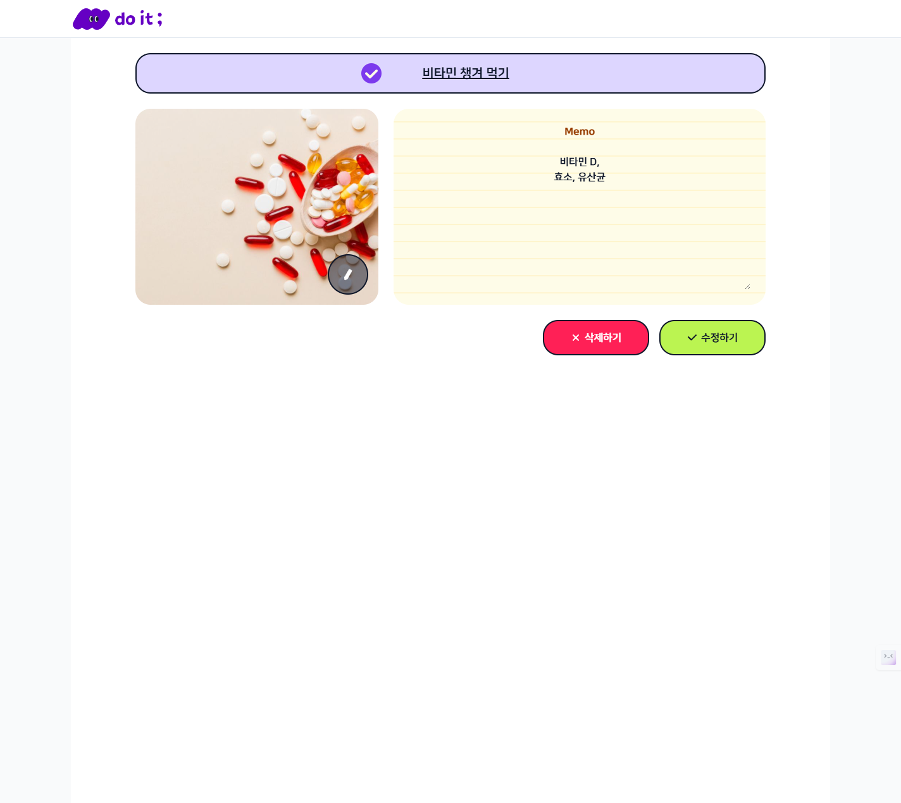
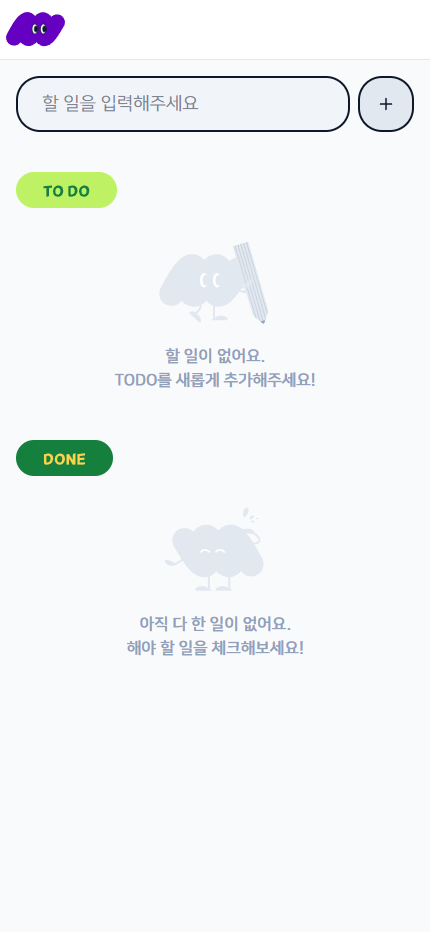
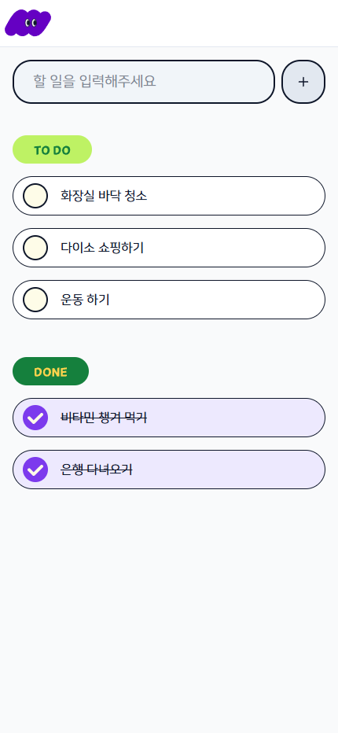
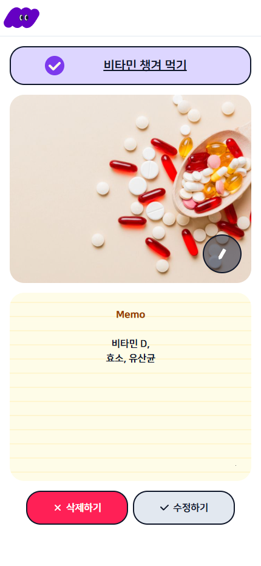

# 📝 To Do List Project
할 일 목록을 관리하는 To Do 서비스

 

## 🔧 Stack
 &nbsp; 
 &nbsp; 
 &nbsp; 
 &nbsp; 

 

## 1️⃣ 메인 화면

### **목록 조회** 
+ 메인 페이지 접속 시, 진행중인 일과 완료된 할 일이 구분되어 나타납니다.
+ 할 일일 항목을 클릭하면 상세 페이지로 이동합니다.
### 할일 추가하기
+ 상단의 입력창에 할일을 작성하고 `추가하기` 버튼을 클릭하거나 `엔터키`를 누르면 새로운 할일이 생성됩니다.
### 할일 완료 처리하기
+ 진행 중인 할 일 항목의 체크박스를 클릭했을 때 완료 상태로 변경됩니다
+ 완료된 할 일 항목의 체크박스를 클릭했을 때 다시 진행 중 상태로 변경됩니다.

 

## 2️⃣ 할 일 상세 페이지
 &nbsp; 

### 할일 수정하기
+ 항목 이름, 상태(진행/완료)를 수정할 수 있습니다.
+ 메모를 추가/수정 할 수 있습니다.
+ 이미지(최대1개)를 첨부/수정 할 수 있습니다.
    + 이미지 파일 이름은 영어로만 가능합니다.
    + 파일 크기는 5MB 이하여야 합니다.
+ `수정 완료` 버튼을 클릭하면 수정 사항이 반영되고 할 일 목록 페이지로 이동합니다.
### 할 일 삭제 기능
+ `삭제하기` 버튼을 클릭하면 할 일 삭제가 가능하며, 삭제 후 할일 목록 페이지로 이동합니다.

 

--- 

 

✅ 해당 프로젝트는 반응형으로 제작되어 모바일, 태플릿, PC 모든 환경에서 사용 가능합니다.

 &nbsp;  &nbsp; 